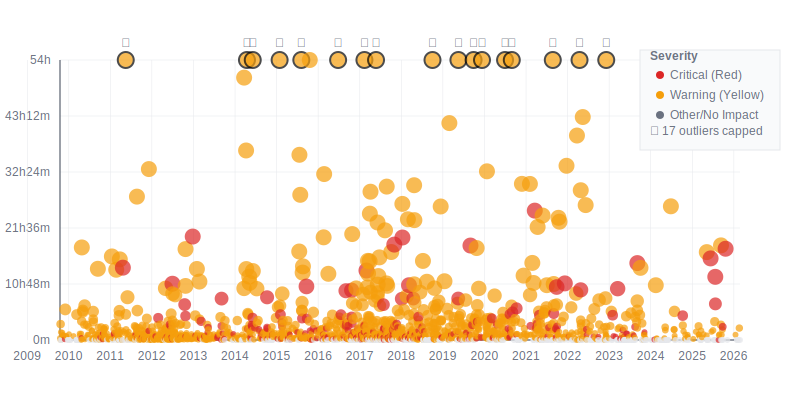

# Heroku Incidents

## Incident Timeline

*This graph shows Heroku incidents from 2020-2025, with downtime duration on the Y-axis and time on the X-axis. Circle size represents downtime duration, and colors indicate severity: red (critical), yellow (warning), gray (other/no impact).*

A structured JSON representation of [status.heroku.com/incidents](https://status.heroku.com/incidents), updated daily. I planned to make ~~pretty~~ graphs with this data ([`incidents.json`](incidents.json)) to see if any trends emerge, but ran out of steam. Feel free to!
